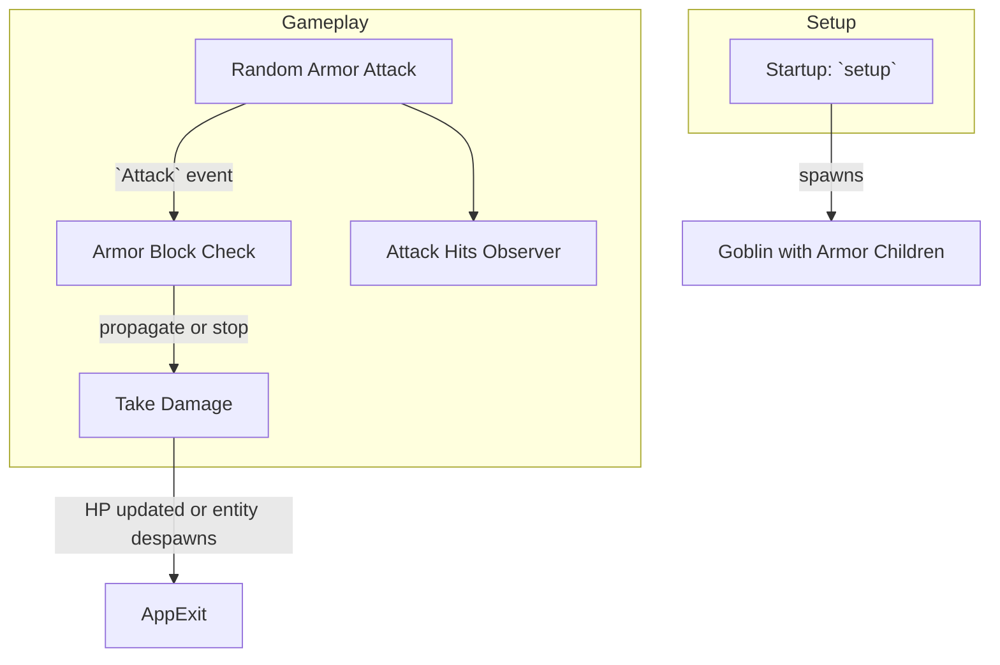

# Project Architecture

This project is a simple example built with [Bevy](https://bevyengine.org/). It demonstrates event propagation through a parent-child hierarchy.

## Module Overview

- **main.rs** – sets up the Bevy `App` with minimal plugins and defines all components, events, and systems.
- **components/** – currently empty; reserved for reusable component definitions.
- **systems/** – placeholder module directory for system code (currently defined directly in `main.rs`).

## Flow of Events

- **Startup system (`setup`)** creates a `Goblin` entity with three armor children (`Helmet`, `Socks`, `Shirt`), each observing the `block_attack` callback.
- **`attack_armor`** randomly targets a piece of armor and triggers an `Attack` event.
- **`block_attack`** checks if the armor absorbs the damage and decides whether the event propagates to the parent (`Goblin`).
- **`take_damage`** receives any `Attack` events that reach the `Goblin` and reduces its `HitPoints`. If HP reaches zero, the entity despawns and the app exits.
- **`attack_hits`** is a global observer logging whenever an attack lands on any entity.

This simple flow shows how events can bubble through an entity hierarchy in Bevy.
